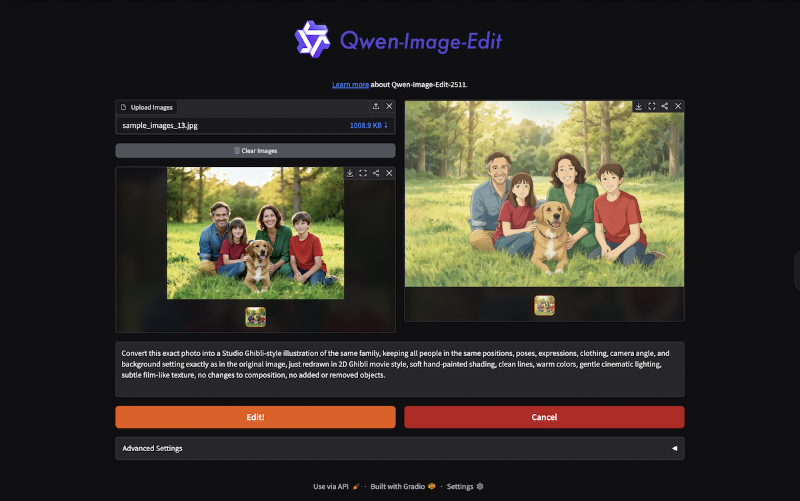

# Qwen Image Edit 2511 - EKS Deployment

AI-powered image editing using the Qwen Vision Language Model,
deployed on Amazon EKS with GPU acceleration.



## Architecture

```text
                           USERS
                             |
                             v
                     +---------------+
                     |  ALB Ingress  |
                     |  (HTTPS/443)  |
                     +-------+-------+
                             |
              +--------------+--------------+
              |  /api, /health              |  / (all other)
              v                             v
    +-------------------+        +-------------------+
    |   Model Service   |        |    UI Service      |
    |   (FastAPI)       |        |    (Gradio)        |
    |   Port 8000       |        |    Port 7860       |
    |                   |        |                    |
    |   NVIDIA L40S GPU |        |    No GPU needed   |
    |   ~6GB image      |        |    ~200MB image    |
    |   24Gi memory     |        |    512Mi memory    |
    +--------+----------+        +---------+----------+
             |                             |
             |  Loads model from           |  Calls model via
             |  /mnt/qwen-models           |  cluster DNS:
             |                             |  qwen-model-service
             v                             |  .qwen.svc:8000
    +-------------------+                  |
    |  DaemonSet        |                  |
    |  (Model Cache)    |<-----------------+
    |                   |
    |  Downloads model  |
    |  from S3 to node  |
    |  local EBS on     |
    |  first boot       |
    +--------+----------+
             |
             v
    +-------------------+
    |  S3 Bucket        |
    |  17GB model       |
    |  (4-bit quantized)|
    +-------------------+
```

### Two-Container Design

| Container           | Image Size | GPU                     | Purpose              |
| ------------------- | ---------- | ----------------------- | -------------------- |
| **Model** (FastAPI) | ~6GB       | NVIDIA L40S (48GB VRAM) | Inference engine     |
| **UI** (Gradio)     | ~200MB     | None                    | Interactive frontend |

Separating UI from model allows fast UI iteration
without rebuilding the heavy model container.

## Deployment Flow

```text
  1. CONFIGURE             2. BUILD                 3. DEPLOY

  cp .env.example .env     build-and-push-all.sh    setup-eks-prerequisites.sh
  vim .env                        |                  install-alb-controller.sh
       |                   +------+------+           create-ecr-repos.sh
       v                   |             |                  |
  +----------+      +------v---+  +------v---+       +-----v------+
  | .env     |      | Docker   |  | Docker   |       | Kustomize  |
  | AWS_ACCT |      | Model    |  | UI       |       | k8s/base/  |
  | REGION   |----->| Image    |  | Image    |       | config.yaml|
  | CLUSTER  |      +------+---+  +------+---+       +-----+------+
  | ...      |             |             |                  |
  +----------+             v             v                  v
                     +-----+-------------+---+       +------+------+
                     |         ECR           |       |    EKS      |
                     |  qwen-model:v1        |------>|  Namespace: |
                     |  qwen-ui:v1           |       |  qwen       |
                     +-----------------------+       +-------------+

  4. ACCESS

  https://your-domain.com  -->  ALB  -->  Gradio UI  -->  FastAPI Model
       or
  kubectl port-forward -n qwen svc/qwen-model-service 8000:8000
  python scripts/batch_process_fastapi.py
```

## Quick Start

### 1. Configure

```bash
cp .env.example .env
```

Edit `.env` with your values:

```bash
AWS_ACCOUNT_ID=123456789012
AWS_REGION=us-east-1
EKS_CLUSTER_NAME=my-eks-cluster
EKS_NODEGROUP_NAME=gpu-nodes
K8S_NAMESPACE=qwen
ECR_REPO_UI=qwen-ui
ECR_REPO_MODEL=qwen-model
```

Also copy and configure the Kubernetes config:

```bash
cp k8s/base/config.yaml.example k8s/base/config.yaml
```

### 2. Setup EKS Prerequisites

```bash
# Verify tools are installed (aws, kubectl, docker, helm)
./scripts/verify-prerequisites.sh

# Create ECR repositories
./scripts/create-ecr-repos.sh

# Setup IAM roles, EFS, S3 access
./scripts/setup-eks-prerequisites.sh

# Install ALB ingress controller
./scripts/install-alb-controller.sh
```

### 3. Build and Push

```bash
# Build and push both containers to ECR
./scripts/build-and-push-all.sh v1

# Or individually
./scripts/build-and-push-model.sh v1
./scripts/build-and-push-ui.sh v1
```

### 4. Deploy

```bash
./scripts/deploy.sh
```

### 5. Verify

```bash
# Watch pods come up
kubectl get pods -n qwen -w

# Check status
make status
```

## Makefile Commands

```bash
make help                          # Show all commands
make verify                        # Check prerequisites
make build-and-push-all VERSION=v1 # Build + push both containers
make deploy                        # Deploy to EKS
make status                        # Deployment status
make logs                          # Tail all logs
make logs-model                    # Tail model logs
make logs-ui                       # Tail UI logs
make port-forward                  # Port-forward to model service
make batch                         # Run batch test
make clean                         # Remove local artifacts
```

## API

The model service exposes a FastAPI REST API on port 8000.

### Health Check

```bash
kubectl port-forward -n qwen svc/qwen-model-service 8000:8000
curl http://localhost:8000/api/v1/health | jq
```

```json
{
  "status": "healthy",
  "model_loaded": true,
  "gpu_available": true,
  "gpu_memory_used_gb": 18.2,
  "gpu_memory_total_gb": 48.0
}
```

### Batch Inference

```bash
curl -X POST http://localhost:8000/api/v1/batch/infer \
  -H "Content-Type: application/json" \
  -d '{
    "images": [{"data": "<base64-encoded-image>"}],
    "prompt": "Convert to Studio Ghibli style",
    "seed": 42,
    "guidance_scale": 3.0,
    "num_inference_steps": 20,
    "height": 1024,
    "width": 1024
  }'
```

| Endpoint              | Method | Description                  |
| --------------------- | ------ | ---------------------------- |
| `/api/v1/health`      | GET    | Health check with GPU status |
| `/api/v1/batch/infer` | POST   | Batch image inference        |
| `/api/docs`           | GET    | Swagger UI documentation     |

### Batch Testing Script

The batch script processes all images in `samples_images/`
against the FastAPI endpoint:

```bash
# Port-forward to model service
kubectl port-forward -n qwen svc/qwen-model-service 8000:8000

# Run with defaults
python scripts/batch_process_fastapi.py

# Custom prompt
python scripts/batch_process_fastapi.py --prompt "Make it a watercolor painting"

# All options
python scripts/batch_process_fastapi.py --url http://localhost:8000 \
  --steps 30 --guidance-scale 5.0 --seed 123 --output ./results
```

## Project Structure

```text
.
├── .env.example                  # Environment config template (cp to .env)
├── Dockerfile.model              # Model container (CUDA + FastAPI)
├── Dockerfile.ui                 # UI container (Python slim + Gradio)
├── Makefile                      # Build/deploy/status commands
├── requirements-base.txt         # PyTorch, transformers, diffusers
├── requirements-app.txt          # FastAPI, Gradio, Pydantic
├── requirements-ui.txt           # UI container dependencies
├── src/
│   ├── server.py                 # FastAPI model service (port 8000)
│   └── app_ui.py                 # Gradio UI (port 7860)
├── k8s/
│   ├── base/
│   │   ├── config.yaml.example   # Kustomize config template
│   │   ├── kustomization.yaml    # Replacement rules
│   │   ├── namespace.yaml        # qwen namespace
│   │   ├── serviceaccount.yaml   # IAM role for S3 access
│   │   ├── deployment-model.yaml # Model pod (GPU, 24Gi)
│   │   ├── deployment-ui.yaml    # UI pod (no GPU, 512Mi)
│   │   ├── service-model.yaml    # ClusterIP :8000
│   │   ├── service-ui.yaml       # ClusterIP :7860
│   │   ├── ingress.yaml          # ALB with path-based routing
│   │   └── daemonset-model-cache.yaml  # S3 model download per node
│   └── alb-controller/
│       └── iam-policy.json       # ALB controller IAM permissions
├── scripts/
│   ├── common.sh                 # Shared config (sources .env)
│   ├── build-and-push-all.sh     # Build + push both containers
│   ├── build-and-push-model.sh   # Build + push model container
│   ├── build-and-push-ui.sh      # Build + push UI container
│   ├── deploy.sh                 # kubectl apply -k k8s/base/
│   ├── setup-eks-prerequisites.sh # IAM, EFS, S3 setup
│   ├── install-alb-controller.sh # ALB ingress controller
│   ├── create-ecr-repos.sh       # Create ECR repositories
│   ├── verify-prerequisites.sh   # Check tools and access
│   ├── check-gpu-availability.sh # GPU instance capacity check
│   └── batch_process_fastapi.py  # Batch test against API
└── samples_images/               # 18 test images + prompts
```

## Performance

| Metric               | Value                  |
| -------------------- | ---------------------- |
| Model Size           | 17GB (4-bit quantized) |
| First Node Boot      | 4-5 min (S3 download)  |
| Pod Startup (cached) | 10-15 sec              |
| GPU Memory Usage     | ~18GB / 48GB (L40S)    |
| Inference Speed      | ~3 sec per step        |
| RAM Required         | 20GB                   |
| Storage per Node     | 20GB (model cache)     |

## AWS Requirements

- **EKS Cluster**: v1.28+
- **Node Group**: `g6e.xlarge` (NVIDIA L40S, 48GB VRAM), 100GB EBS
- **S3 Bucket**: 17GB for model weights
- **ECR**: Two repositories (~7GB total)
- **IAM Role**: S3 read access via IRSA
- **ACM Certificate**: For HTTPS (optional)

## Troubleshooting

**DaemonSet init container fails with "AccessDenied"**
Verify IAM role has S3 read permissions and IRSA is configured.

**ErrImagePull "no match for platform"**
Image built on Apple Silicon (ARM64) but EKS runs AMD64.
All build scripts include `--platform linux/amd64`.

**Model not found in cache**
Wait for DaemonSet to complete. Check:
`kubectl logs -n qwen -l app=qwen-model-cache -c download-model`

**Pod stuck in Pending**
No GPU nodes available. Check: `./scripts/check-gpu-availability.sh`

## Resources

- [Qwen-Image-Edit-2511-4bit][qwen-4bit] (HuggingFace)
- [Qwen-Image-Edit-2511][qwen-orig] (Original model)
- [Amazon EKS User Guide][eks-docs]

[qwen-4bit]: https://huggingface.co/ovedrive/Qwen-Image-Edit-2511-4bit
[qwen-orig]: https://huggingface.co/Qwen/Qwen-Image-Edit-2511
[eks-docs]: https://docs.aws.amazon.com/eks/

## License

This deployment configuration is provided as-is.
Refer to the Qwen model license for model usage terms.
